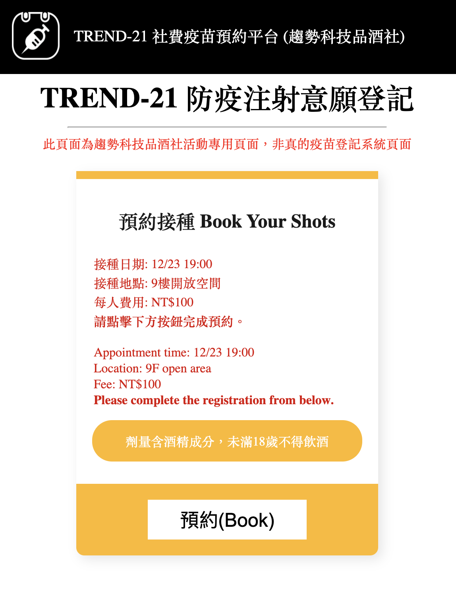

# TREND-21 社費疫苗預約平台 (趨勢科技品酒社)

## !!! 此頁面為趨勢科技品酒社活動專用頁面，非真的疫苗登記系統頁面 !!!

## TREND-21疫苗12/23開放施打！指揮中心呼籲打滿兩劑疫苗，防範Xmas變異株來襲


撰文者：醺傳媒／Baby Shot Du Du

趨勢品酒網｜2021.12.23

摘要：

- 因應國內疫情趨緩，指揮中心雖宣布２級警戒延長至12/25，但防疫措施鬆綁之餘，仍建議民眾儘速施打滿兩劑疫苗。指揮官陳年高宣布，開放所有已滿18歲的趨勢民眾，都可使用意願登記系統預約施打兩劑疫苗。
- 目前僅開放民眾施打兩劑疫苗，政府已經有購置足夠民眾們施打的庫存，至於第三劑疫苗是否需要接種，指揮官陳年高表示如果施打兩劑還醒著，會再依照施打狀況做滾動式調整。
- TREND-21 防疫注射意願登記系統將於即日起上線，請民眾於12/23晚間19:00時，步行至A棟9樓開放空間，備妥PSID及繳交掛號費$100，領取「TREND-21疫苗接種紀錄卡」後接受疫苗施打。

TREND-21 防疫注射意願登記系統：https://sean1093.github.io/trend-shots-register/


```json
{
    "title": "預約接種 Book Your Shots",
    "date": "接種日期: 12/23 19:00",
    "location": "接種地點: 9樓開放空間",
    "fee": "每人費用: NT$100"
}
```




